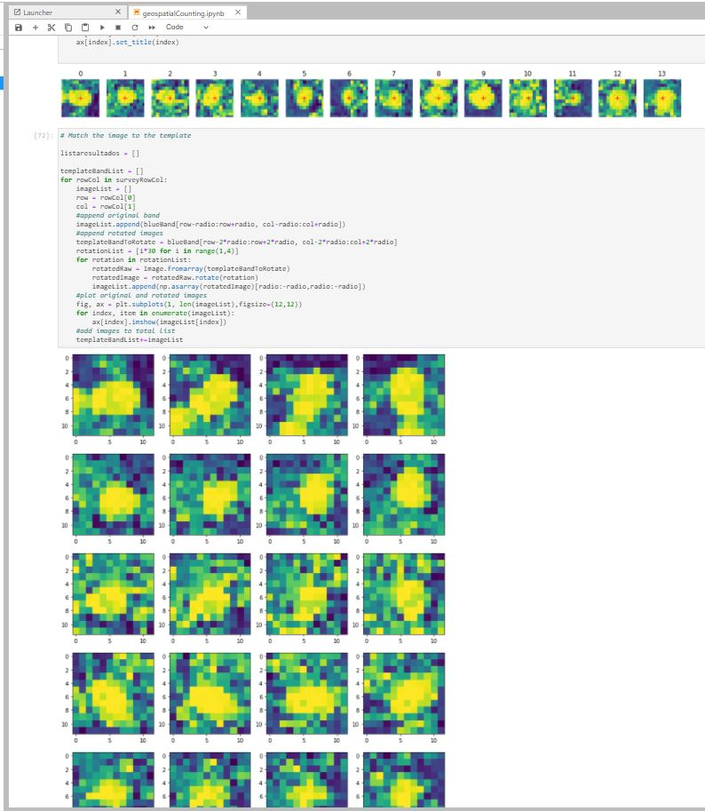

# Pumpinks_Project_image_extraction
A small project for pumpkins number extraction from an aerial image 

I created this as a small test project using scikit-image & templates to identify and extract an estimated number of pumpkins from an aerial image above a farm plot.
#Python3, #JupyterNotebook, #scikit-image

The original image:

Matching templates:

Refined results (red dots=pumpkins):

